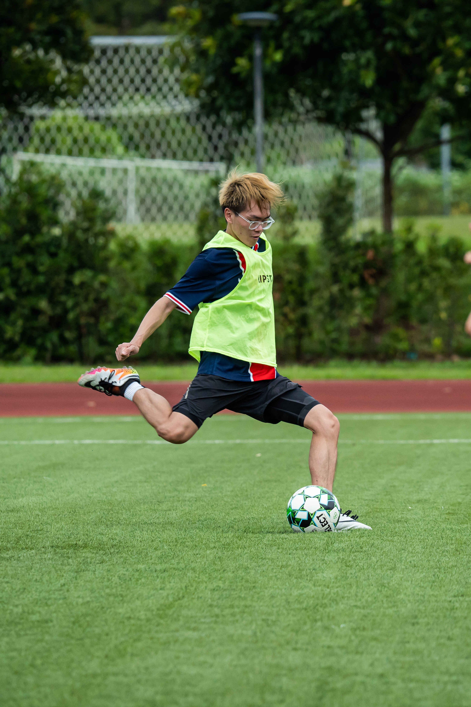
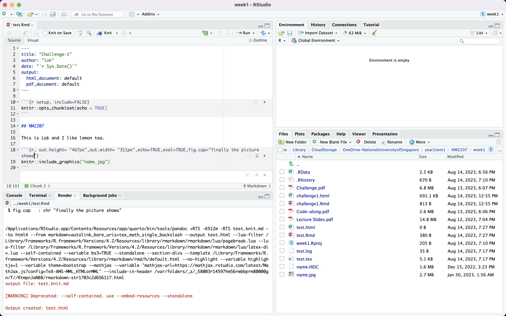

```{r setup, include=FALSE}
knitr::opts_chunk$set(echo = TRUE)
```

## NM2207

This is Lok and I like lemon tea.

```{r, out.height= "400px",out.width= "261px",echo=TRUE,eval=TRUE,fig.cap="finally the picture shows"}

```

```{r, out.height= "250px",out.width= "600px",echo=TRUE,eval=TRUE,fig.cap="the screenshot"}

```